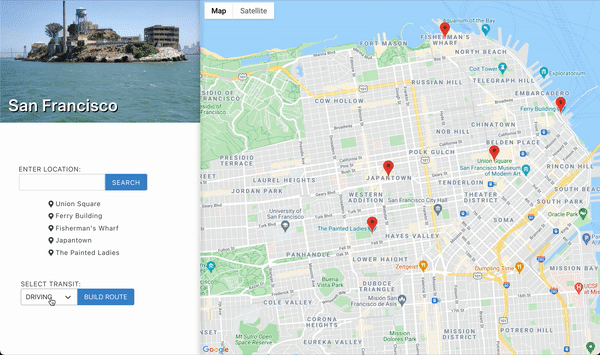
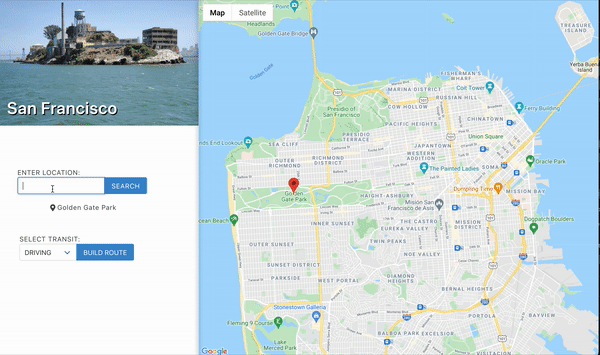

<h1 align="center">Trip Planner</h1>

<h2 align="center">Features:</h2>

<h3 align="center">
📍 Dynamic viewport based on user-selected destination stops

📍 Autocomplete search box integrated with Google Places API
</h3>

</h3>

  

<h3 align="center">
  📍 Direction rendering including waypoints and multiple transit types
</h3>

<h3 align="center">
  📍 Interactive markers that spawn info modals with name and image of location
</h3>

  

</h3>